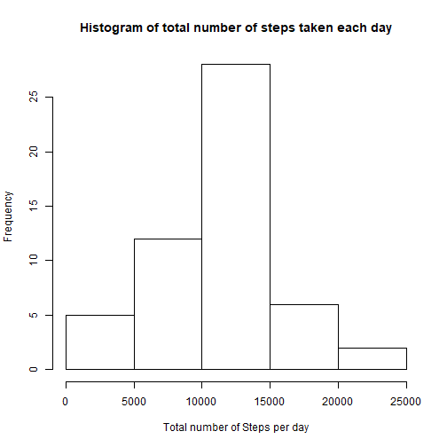
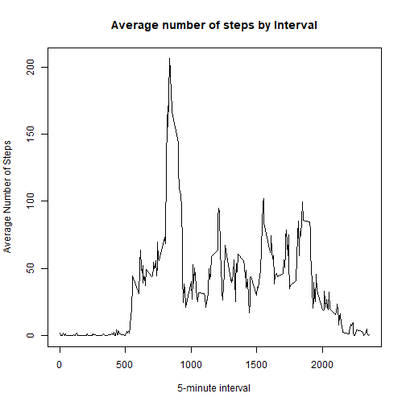
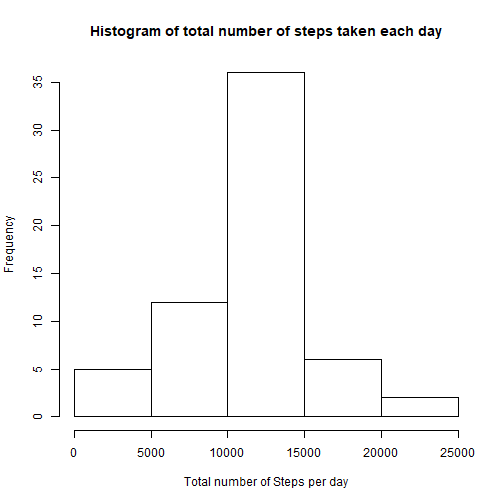
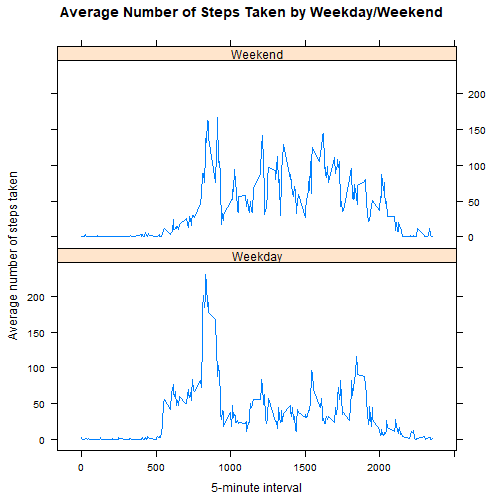

## Personal Movement Analysis


**Loading and preprocessing the data**

1. Load the data

```r
df=read.csv("activity.csv")
str(df)
```

```
## 'data.frame':	17568 obs. of  3 variables:
##  $ steps   : int  NA NA NA NA NA NA NA NA NA NA ...
##  $ date    : Factor w/ 61 levels "2012-10-01","2012-10-02",..: 1 1 1 1 1 1 1 1 1 1 ...
##  $ interval: int  0 5 10 15 20 25 30 35 40 45 ...
```
2. Process/transform the data (if necessary) into a format suitable for your analysis

```r
#Convert to date fromat
df$date=as.Date(df$date)
str(df)
```

```
## 'data.frame':	17568 obs. of  3 variables:
##  $ steps   : int  NA NA NA NA NA NA NA NA NA NA ...
##  $ date    : Date, format: "2012-10-01" "2012-10-01" "2012-10-01" "2012-10-01" ...
##  $ interval: int  0 5 10 15 20 25 30 35 40 45 ...
```

**What is mean total number of steps taken per day?**

1. Calculate the total number of steps taken per day

```r
steps_day <- aggregate(steps~date,data=df,  FUN=sum)
steps_day
```

```
##          date steps
## 1  2012-10-02   126
## 2  2012-10-03 11352
## 3  2012-10-04 12116
## 4  2012-10-05 13294
## 5  2012-10-06 15420
## 6  2012-10-07 11015
## 7  2012-10-09 12811
## 8  2012-10-10  9900
## 9  2012-10-11 10304
## 10 2012-10-12 17382
## 11 2012-10-13 12426
## 12 2012-10-14 15098
## 13 2012-10-15 10139
## 14 2012-10-16 15084
## 15 2012-10-17 13452
## 16 2012-10-18 10056
## 17 2012-10-19 11829
## 18 2012-10-20 10395
## 19 2012-10-21  8821
## 20 2012-10-22 13460
## 21 2012-10-23  8918
## 22 2012-10-24  8355
## 23 2012-10-25  2492
## 24 2012-10-26  6778
## 25 2012-10-27 10119
## 26 2012-10-28 11458
## 27 2012-10-29  5018
## 28 2012-10-30  9819
## 29 2012-10-31 15414
## 30 2012-11-02 10600
## 31 2012-11-03 10571
## 32 2012-11-05 10439
## 33 2012-11-06  8334
## 34 2012-11-07 12883
## 35 2012-11-08  3219
## 36 2012-11-11 12608
## 37 2012-11-12 10765
## 38 2012-11-13  7336
## 39 2012-11-15    41
## 40 2012-11-16  5441
## 41 2012-11-17 14339
## 42 2012-11-18 15110
## 43 2012-11-19  8841
## 44 2012-11-20  4472
## 45 2012-11-21 12787
## 46 2012-11-22 20427
## 47 2012-11-23 21194
## 48 2012-11-24 14478
## 49 2012-11-25 11834
## 50 2012-11-26 11162
## 51 2012-11-27 13646
## 52 2012-11-28 10183
## 53 2012-11-29  7047
```

2. Make a histogram of the total number of steps taken each day

```r
hist(steps_day$steps, main = "Histogram of total number of steps taken each day", xlab = "Total number of Steps per day")
```



3. Calculate and report the mean and median of the total number of steps taken per day

```r
print(paste("Mean of the total number of steps per day: ",round(mean(steps_day$steps),2)))
```

```
## [1] "Mean of the total number of steps per day:  10766.19"
```

```r
print(paste("Median of the total number of steps per day: ",round(median(steps_day$steps),2)))
```

```
## [1] "Median of the total number of steps per day:  10765"
```

**What is the average daily activity pattern?**

1. Make a time series plot of the 5-minute interval (x-axis) and the average number of steps taken, averaged across all days (y-axis)

```r
steps_interval <- aggregate(steps~interval,data=df,  FUN=mean)
plot(steps_interval$interval,steps_interval$steps, type="l", ylab="Average Number of Steps", xlab="5-minute interval",main="Average number of steps by Interval")
```



2. Which 5-minute interval, on average across all the days in the dataset, contains the maximum number of steps?

```r
print(paste("The maximum number of steps ",round(steps_interval[steps_interval$steps==max(steps_interval$steps),]$steps,2)," is taken in the interval ",steps_interval[steps_interval$steps==max(steps_interval$steps),]$interval))
```

```
## [1] "The maximum number of steps  206.17  is taken in the interval  835"
```

**Imputing missing values**

1. Calculate and report the total number of missing values in the dataset (i.e. the total number of rows with NAs)

```r
sum(is.na(df))
```

```
## [1] 2304
```

2. Devise a strategy for filling in all of the missing values in the dataset.
To handle the missing data, we will fill it with the mean of that 5-min interval.

3.Create a new dataset that is equal to the original dataset but with the missing data filled in.

```r
my_data=df 
for(i in steps_interval){
  my_data[my_data$interval==i & is.na(my_data$steps),]$steps=steps_interval[steps_interval$interval==i,]$steps
}
sum(is.na(my_data))
```

```
## [1] 0
```

4. Make a histogram of the total number of steps taken each day and Calculate and report the mean and median total number of steps taken per day. Do these values differ from the estimates from the first part of the assignment? What is the impact of imputing missing data on the estimates of the total daily number of steps?

```r
my_steps_day <- aggregate(steps~date,data=my_data,  FUN=sum)
hist(my_steps_day$steps, main = "Histogram of total number of steps taken each day", xlab = "Total number of Steps per day")
```



```r
print(paste("Mean of the total number of steps per day: ",round(mean(my_steps_day$steps),2)))
```

```
## [1] "Mean of the total number of steps per day:  10766.19"
```

```r
print(paste("Median of the total number of steps per day: ",round(median(my_steps_day$steps),2)))
```

```
## [1] "Median of the total number of steps per day:  10766.19"
```
The mean still remains the same, however, there is a slight change in the median. Since we used the mean to fill in the NA values, it makes that the median is equal to mean.

**Are there differences in activity patterns between weekdays and weekends?**

1.Create a new factor variable in the dataset with two levels – “weekday” and “weekend” indicating whether a given date is a weekday or weekend day.

```r
my_data$IsWeekday= as.factor(ifelse(weekdays(my_data$date) %in% c("Saturday", "Sunday"), "Weekend", "Weekday"))
str(my_data)
```

```
## 'data.frame':	17568 obs. of  4 variables:
##  $ steps    : num  1.717 0.3396 0.1321 0.1509 0.0755 ...
##  $ date     : Date, format: "2012-10-01" "2012-10-01" "2012-10-01" "2012-10-01" ...
##  $ interval : int  0 5 10 15 20 25 30 35 40 45 ...
##  $ IsWeekday: Factor w/ 2 levels "Weekday","Weekend": 1 1 1 1 1 1 1 1 1 1 ...
```

2.Make a panel plot containing a time series plot of the 5-minute interval (x-axis) and the average number of steps taken, averaged across all weekday days or weekend days (y-axis). 

```r
steps_weekdays <- aggregate(steps~interval+IsWeekday,data=my_data,  FUN=mean)
library(lattice)
xyplot(steps ~ interval | IsWeekday, data = steps_weekdays, type = "l", 
       layout = c(1, 2), 
       xlab = "5-minute interval", 
       ylab = "Average number of steps taken",
       main = "Average Number of Steps Taken by Weekday/Weekend")
```



